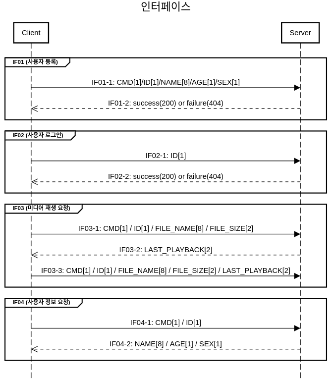

## 인터페이스 명세

<!-- ### 시스템 연계
-   Socket: 서버는 통신을 위한 소켓을 생성하여 포트를 할당하고 클라이언트의 통신 요청 시 클라이언트와 연결하여 통신하는 네트워크 기술이다. -->


1. `IF01`: 회원가입
-  `IF01-1`: 사용자 정보를 서버로 전송
   - cmd [0x00]
   - 데이터 규격
```c
char cmd;
typedef struct UserInfo{
    char name[16];
    unsigned int age;
    unsigned int sex;
} UserInfo;
```

-   `IF01-2`: 사용자 ID값을 서버로부터 수신   
    - cmd [0x00]
    - 데이터 규격
```c
char cmd;
unsigned int id;
```


1.  `IF02`: 사용자 로그인 요청
-   `IF02-1`: 사용자 ID를 서버로 전송
    -   cmd: [0x01]
    -   데이터 규격
```c
char cmd;
unsigned int id;
```


-   `IF02-2`: 사용자 로그인 승인 여부를 서버로부터 수신
    - cmd [0x01]
    - 데이터 규격
    - is_success : 0 -> 로그인 성공
    - is_success : 1 -> 로그인 실패
```c
char cmd;
int is_success;
```


3.  `IF03`: 미디어 재생 요청
-   `IF03-1`: 사용자 ID와 미디어 정보를 서버로 전송
    -  cmd: [0x02]
    -  데이터 규격
```c
char cmd;
unsigned int id;
typedef struct MediaInfo{
    char file_name[256];
    unsigned int file_size;
    signed long played;
} MediaInfo;
```


-   `IF03-2`: 해당 미디어의 이전 재생 기록 정보를 서버로부터 수신
    -   cmd: [0x02]
    -   데이터 규격
```c
char cmd;
signed long played;
```


-   `IF03-3`: 미디어 재생이 종료될 시, 갱신된 재생 기록 정보를 서버로 전송
    -   cmd: [0x03]
    -   데이터 규격

```c
typedef signed long gint64;

char cmd;
unsigned int id;
typedef struct MediaInfo{
    char file_name[256];
    unsigned int file_size;
    signed long played;
} MediaInfo;
```

4.  `IF04`: 사용자 정보 요청
-   `IF04-1`: 사용자의 정보를 서버에게 요청
    -   cmd: [0x04]
    -   데이터 규격
```c
char cmd;
unsigned int id;
```


-   `IF04-2`: 사용자의 정보를 서버로부터 수신
    -   cmd [0x04]
    -   데이터 규격
```c
char cmd;
typedef struct UserInfo{
    unsigned int id;
    char name[16];
    unsigned int age;
    unsigned int sex;
} UserInfo;
```




<!-- 5. 로그인 [0001]
uint8_t buffer[16]
cmd 1 (8)
id 1 (8)

1. 미디어 재생 요청[0010]
uint8_t buffer[16]
cmd 1 (8)
id 1 (8)
FILE_NAME 8 (64)
FILE_SIZE 2 (16)

4. 미디어 기록 저장 요청[0011]
uint8_t buffer[16]
cmd 1 (8)
id 1 (8)
FILE_NAME 8 (64)
FILE_SIZE 2 (16)
LAST_FLIP 4 (32)

5. 사용자 정보 요청[0100]
uint8_t buffer[16]
cmd 1 (8)
id 1 (8)

6. 메타데이터 저장[0101]
uint8_t buffer[16]
cmd 1 (8)
id 1 (8)
FILE_NAME 8 (64)
FILE_SIZE 2 (16)
META_DATA 4 (32)

7. 최근 재생 목록 요청[0110]
uint8_t buffer[16]
cmd 1 (8)
id 1 (8) -->


