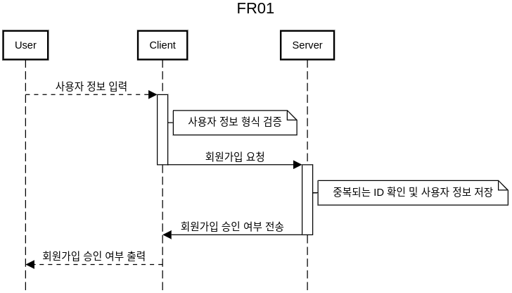
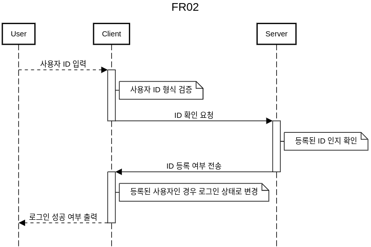

## 테스트 계획
-  모듈 테스트 -> 통합테스트 -> 시스템 테스트

<!-- `FR03-1`(로컬 미디어 정보 확인), `FR05` (로그아웃)을 제외한 모든 기능은 서버와의 통신을 필요로 한다. 유닛 테스트 하기 위해 Dummy 서버를 작성한다. Dummy 서버에서는 단순히 클라이언트에서 온 데이터를 수신하고, 지정된 데이터를 전송한다.  -->

### 모듈 테스트
-  `FR01`, `FR02`, `FR04` 은 각각 하나의 모듈로 가정하고 모듈테스트를 진행한다. 
-  `FR01`, `FR02`, `FR04` 은 모두 서버와 동일한 통신과정(송/수신)을 거친다. 즉, 하나의 더미 서버로 각각의 기능에 대해 모듈 테스트를 진행할 수 있다.
-  모듈 테스트 환경은 아래와 같다.

  
-  Module : 테스트하고자 하는 기능
-  Socket : 서버와의 인터페이스
-  Dummy server : 클라이언트와의 통신을 확인하기 위한 서버
-  Input : 테스트를 위한 입력
-  Output : 기대값과 일치하는지 확인 

<!-- 
### 테스트 시나리오 
무엇을 테스트 할 것인가

### 테스트 케이스
요구사항을 테스트 할 방법 -->

1. `FR01`: 회원가입

-  테스트 시나리오
   1. 사용자 정보 형식 검증
      -  사용자가 입력한 정보의 형식이 입력받고자 하는 형식과 일치하는지
      -  일치하지 않는다면 로그인 이전 대기상태로 이동하는지
      -  일치한다면 다음 단계로 넘어가는지
   2. 회원가입 요청
      -   cmd값과 회원가입을 위한 사용자 정보가 서버로 정확히 전송되었는지
   3. 서버로부터 회원가입 승인 여부 수신
      -  사용자 회원가입 여부가 정확히 수신되었는지
      -  수신이 1초 이상 걸린다면 타임아웃이 출력되는지
   4. 회원가입 승인 여부 출력
      -  수신된 정보에 따라 사용자에게 회원가입 승인 여부가 출력되는지

<!-- -  `FR01-1` 기능을 테스트하기 위해 2가지 입력에 대해서 2가지 출력을 확인한다. 각각의 입/출력은 클라이언트 프로그램을 기준으로 한다.

-  Input
   -  User: 사용자 정보
   -  Server: 등록 성공 (0) / 등록 실패 (1)

-  Output
   - User: 사용자 정보 형식이 틀림을 출력 / 사용자 등록 승인 여부 출력
   - Server: 사용자 정보가 제대로 전송되었는지 확인 -->

_사용자 정보 : ID, Name, Age, Sex_

2. `FR02`: 로그인

-  테스트 시나리오
   1. 사용자 ID 형식 검증
      -  사용자가 입력한 ID의 형식이 입력받고자 하는 형식과 일치하는지
      -  일치하지 않는다면 로그인 요청하기 전 상태로 이동하는지
      -  일치한다면 다음 단계로 넘어가는지
   2. ID 확인 요청
      -   cmd값과 ID가 서버로 정확히 전송되었는지
   3. 사용자 등록 승인 여부 수신
      -  ID의 등록 여부가 정확히 수신되었는지
      -  수신이 1초 이상 걸린다면 타임아웃이 출력되는지
   4. 사용자 로그인 성공 여부 출력
      -  로그인 실패 시, 로그인에 실패했음이 출력되고, 로그인 이전 대기상태로 이동하는 지
      -  로그인 성공 시, 로그인이 성공했음이 출력되고, 로그인 이후 대기상태로 이동하는 지

<!-- -  `FR02-1` 기능을 테스트하기 위해 2가지 입력에 대해서 2가지 출력을 확인한다. 각각의 입/출력은 클라이언트 프로그램을 기준으로 한다.

-  Input
   -  User: 사용자 정보
   -  Server: 등록된 ID (0) / 등록되지 않은 ID (1)

-  Output
   - User: 사용자 ID 형식이 틀림을 출력 / 사용자 로그인 승인 여부 출력
   - Server: 사용자 ID가 제대로 전송되었는지 확인 -->

3. `FR04-1`: 사용자 정보가 출력

-  테스트 시나리오
   -  사용자 정보 요청
      -  cmd와 ID가 서버로 잘 전송되었는지
   -  사용자 정보 수신
      -  사용자 정보가 정확히 수신되었는지
   -  사용자 정보 출력
      -  사용자 정보가 정확히 출력되는지   

4. `FR03`: 이어보기 미디어 재생

-  테스트 시나리오
   1. `FR03-1`: 미디어 재생 전 단계

      1. 재생 가능한 미디어인지 검증
         -  로컬에 미디어 파일이 존재하고 재생가능한지
         -  미디어 파일이 존재하지않거나 재생이 불가능하면 `Play fail`을 화면에 출력하고, 대기상태로 이동하는지
         -  미디어 파일이 존재하고, 재생가능한 파일이면 다음 단계로 넘어가는지
      2. 서버에 해당 미디어에 대해 이전에 재생한 기록 요청
         -  요청을 위한 ID와 미디어 정보가 정확히 전송되었는지
      3. 서버로부터 이전에 재생한 기록을 수신
         -  이전에 재생한 기록이 정확히 수신되었는지 

   2. `FR03-2`: 미디어 재생 단계
      1. 미디어 스트림 전송
         -  미디어 창이 생성되는지
         -  이전에 재생한 기록에서 재생이 시작되는지
      2. 미디어 재생 제어
         -  사용자가 미디어 재생을 제어(재생/일시정지)할 수 있는지
         -  `QA02`: 사용자가 미디어 재생을 1 step에 수행할 수 있는지

   3. `FR03-3`: 미디어 재생 이후 단계
      1. 최종 재생 기록 갱신 요청
         -  미디어가 종료된 위치에 대한 정보가 서버에 정확히 전송되었는지

_미디어 정보 : file name, file size_

<!-- 1. `FR03-2`, `QA01`: 미디어 정보와 사용자 정보를 서버에 전송하고, 서버로부터 해당 미디어의 재생 기록 정보를 수신하여 미디어를 재생한다.
   -  `FR03-2`
      -  수신한 미디어 재생 기록 정보가 해당 미디어의 재생 시간 이내에 존재할 시, 해당 위치부터 시작함을 확인한다.
      -  수신한 미디어 재생 기록 정보가 해당 미디어의 재생 시간을 벗어날 경우, 처음부터 미디어를 재생한다.
   -  `QA01`: [basic_tutorial](https://gstreamer.freedesktop.org/documentation/tutorials/basic/time-management.html?gi-language=c) 을 통해 사전에 확인하였다.

2. `FR03-3`, `QA02`: 미디어 재생 과정에서 재생 / 일시정지를 지원하는 것을 확인한다.
   -  `FR03-3`: 미디어 재생 과정에서 재생과 일시정지가 정상적으로 동작하는지 확인한다.
   -  `QA02`: 미디어 창이 생성되고, 재생, 일시정지가 한번의 클릭으로 수행되는지 확인한다. -->

1. `FR05-1`: 로그아웃

-  테스트 시나리오
   -  로그아웃되어 로그인 이전 상태로 이동하는지 
