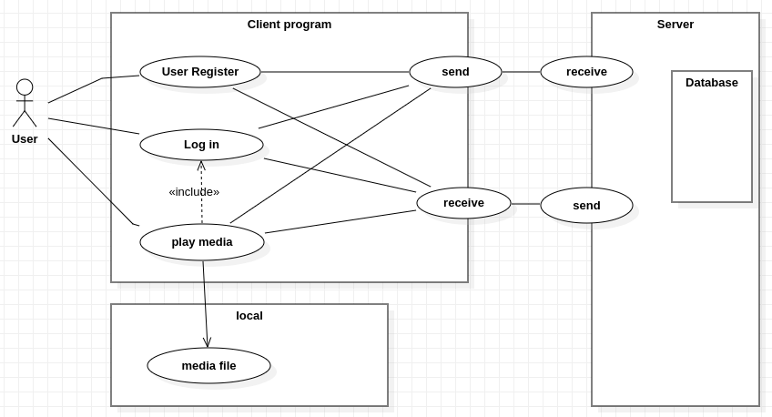

|유스케이스:| User Register |
|------|---|
|관련 액터:|사용자, 서버 - 사용자 목록 (DB)|
|요약|1.사용자가 사용자 정보를 입력한다. 사용자 정보에는 ID와 같은 고유값을 포함한다.  2. 시스템(서버)에서 동일한 ID로 가입한 사용자가 있는지를 확인한다.  3. 시스템(서버)에서는 동일한 ID를 가진 사용자가 없다면 사용자 등록을 승인한다.   4. 사용자는 사용자 등록이 승인되었는지 거부되었는지를 확인한다.|
|선행조건|-|
<!-- |종료조건|서버에서 사용자를 정상적으로 등록하거나, 등록하지 못할경우 반환하는 값을 읽는다.| -->

|유스케이스:| Login |
|------|---|
|관련 액터:| 사용자, 서버 - 사용자 목록 (DB) |
|요약| 1.사용자가 등록한 ID를 입력한다.   2.시스템(서버)에서 등록된 ID가 있는지 확인한다.   3. 서버에 등록된 ID가 있다면 로그인을 승인한다.   4. 사용자가 로그인 상태로 전환된다.
|선행조건|-|
<!-- |종료조건| 사용자 ID와 Name을 입력하면, 서버로 값이 전송된다. 서버에서 사용자 목록 (DB)에 사용자가 있는지 확인하고, 로그인 성공 여부를 반환하는 값을 읽는다.| -->

|유스케이스:| play media |
|------|---|
|관련 액터:| 로컬 - 미디어 목록, 서버 - 미디어 재생 정보 목록(DB) |
|요약|1.사용자가 재생을 원하는 미디어 이름을 입력한다.   2.해당 미디어가 존재하는지, 재생가능한 확장자인지 확인한다.   3.재생가능한 확장자라면 해당 미디어의 정보를 ID와 같이 서버에 전송한다.   4.서버에서 사용자에 대해 동일한 미디어를 재생한 기록이 있는지 확인한다.   5.서버에서 재생 기록 정보를 제공한다.   6. 제공받은 재생 기록 정보를 바탕으로 미디어를 재생한다.   7.미디어가 중단 또는 종료될 시, 해당 재생 위치에 대한 정보를 서버에 전송한다.|
|선행조건| 사용자 로그인 완료 |
|종료조건| 미디어가 마지막까지 재생되거나 사용자가 미디어를 종료한 경우|

<!--  -->